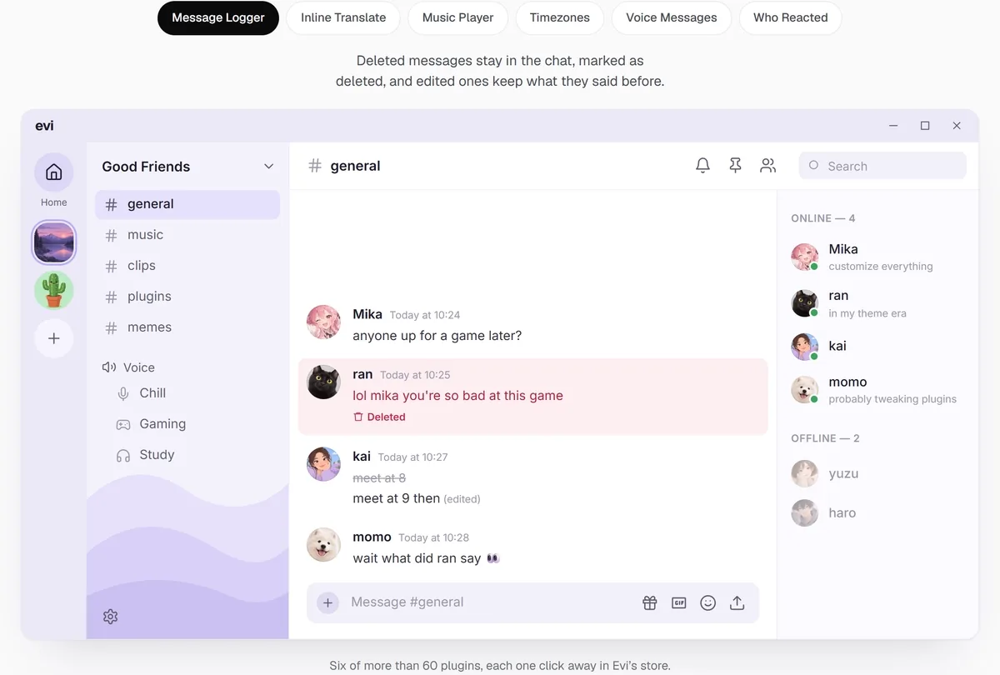
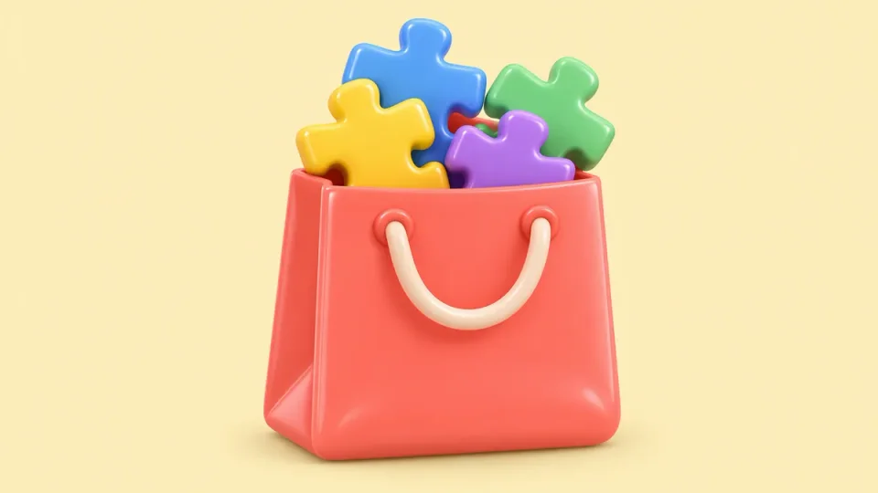
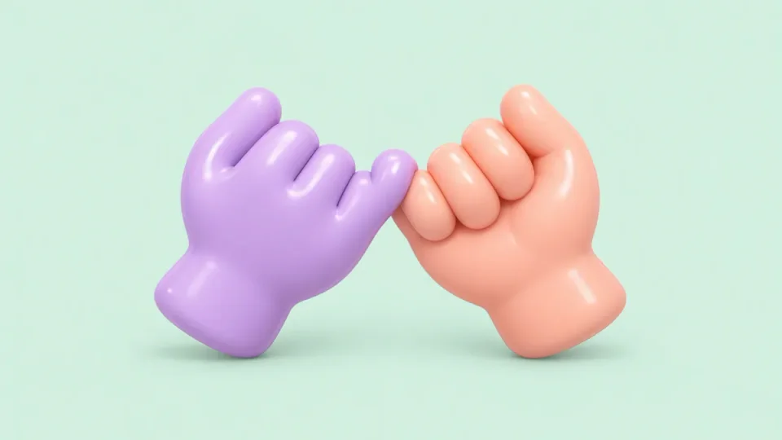
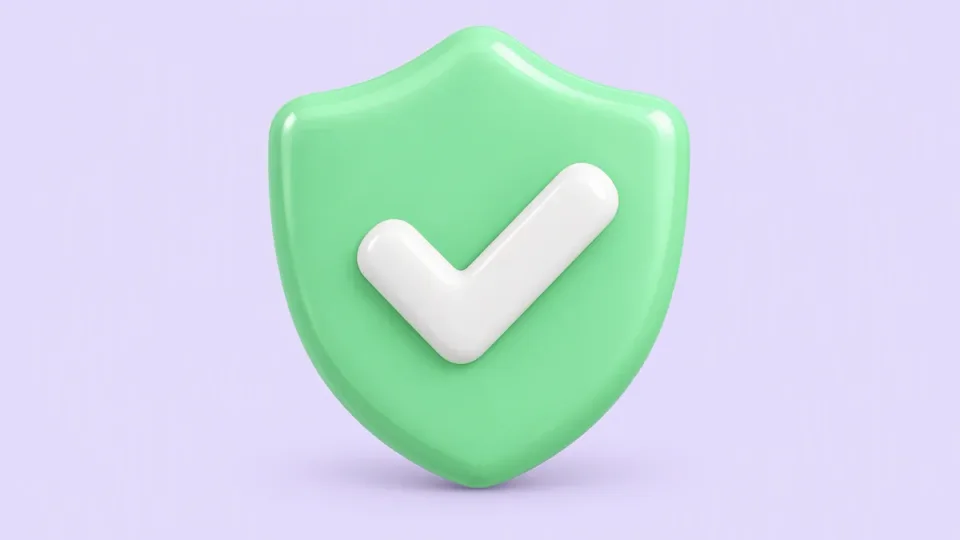
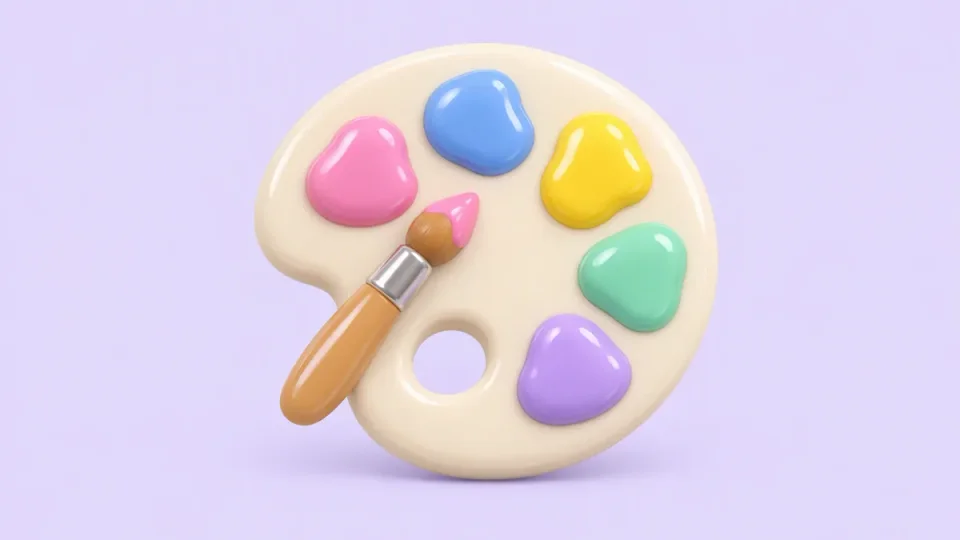
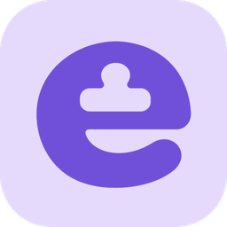

<p align="center">
  <a href="https://evi.rest"></a>
</p>

<p align="center">
  <a href="https://github.com/BleedDev/evi/releases/latest"></a>
  <a href="https://github.com/BleedDev/evi/releases"></a>
  <a href="https://discord.gg/BE4PmvmHB7"></a>
  <a href="LICENSE"></a>
</p>

<p align="center">
  <a href="https://evi.rest/download"><b>Download</b></a> ·
  <a href="https://evi.rest">evi.rest</a> ·
  <a href="https://evi.rest/releases">What's new</a> ·
  <a href="https://discord.gg/BE4PmvmHB7">Discord</a> ·
  <a href="docs/plugins.md">Make a plugin</a>
</p>

<br>

Evi is a client mod for the Discord desktop app. You get a bunch of plugins and themes, it installs in a click, and it keeps itself working when Discord updates.

##  What it looks like

<p align="center">
  
</p>

That's six of them. There are over 60 now, and they're all off until you switch them on.

##  Installing

Grab **Evi Setup** from [evi.rest/download](https://evi.rest/download), pick your Discord and hit **Install Evi**. Discord restarts with Evi in it.

On a Mac, macOS will say it can't verify the app the first time you open it. Go to System Settings → Privacy & Security and click **Open Anyway**, and if it complains about modifying apps, allow it under App Management.

On Linux, mark the download as executable first (right-click → Properties). It'll ask for your password because Discord's folder usually belongs to root. You also need WebKitGTK, which you most likely have already.

Once it's in, open Discord and press **Ctrl+Shift+D**, or look for Evi in Discord's settings. It works with Stable, PTB and Canary. Updates take care of themselves too. Evi asks first, or just updates when you close Discord if you'd rather not be asked.

##  What's in it

<table>
  <tr>
    <td width="50%" valign="top">
      <br>
      <h3>The store</h3>
      It's where you find plugins and themes. Everything in it is free, the name just stuck. You can see what's new or popular, read reviews and install with one click. We read community plugins before they go up.
    </td>
    <td width="50%" valign="top">
      <br>
      <h3>Plugins have to ask</h3>
      Each plugin says up front what it needs, like which sites it talks to or whether it reads your messages. Anything it didn't ask for gets blocked.
    </td>
  </tr>
  <tr>
    <td width="50%" valign="top">
      <br>
      <h3>Hard to break</h3>
      When a Discord update breaks a plugin, we can push a fix to everyone in a few minutes without a new release. If Discord crashes, Evi tells you which plugin was running and offers to turn it off.
    </td>
    <td width="50%" valign="top">
      <br>
      <h3>Make it yours</h3>
      Put a picture or a video behind Discord, or make a theme by picking colours. Plugins can have keyboard shortcuts, and Evi is translated into a few languages.
    </td>
  </tr>
</table>

##  Plugins

These come with Evi. There are more in the store.

<table>
  <tr>
    <td width="50%" valign="top">
      <b>Chat</b><br>
      <b>Message Logger</b> keeps deleted and edited messages around<br>
      <b>Who Reacted</b> puts little avatars on reactions<br>
      <b>Typing Tweaks</b> shows who's typing, even in your channel list<br>
      <b>Inline Translate</b> translates a message right under it<br>
      <b>Snippets</b> for saved replies (<code>/snip</code>)<br>
      <b>Silent Typing</b> hides your "is typing…"<br>
      <b>Voice Message Download</b> saves voice messages as files
    </td>
    <td width="50%" valign="top">
      <b>Friends</b><br>
      <b>Last Seen</b> tells you when someone was last around<br>
      <b>Friend Online Alerts</b> pings you when certain people come online<br>
      <b>Relationship Notifier</b> lets you know if someone unfriends you<br>
      <b>Timezones</b> shows someone's local time next to their name<br>
      <b>Platform Indicators</b> shows if they're on desktop, mobile, web or console<br>
      <b>DM Categories</b> lets you sort DMs into folders<br>
      <b>View Icons</b> opens avatars and banners full size
    </td>
  </tr>
  <tr>
    <td width="50%" valign="top">
      <b>Privacy</b><br>
      <b>Streamer Mode+</b> blurs DMs, servers and images while you stream<br>
      <b>Hide Personal Info</b> blurs your email and phone number in settings<br>
      <b>Link Safety</b> warns you before you open a scam link<br>
      <b>Clear URLs</b> strips tracking stuff from links you send<br>
      <b>Strip Metadata</b> removes GPS info from pictures you upload<br>
      <b>No Track</b> blocks Discord's analytics<br>
      <b>Game Activity Toggle</b> hides what you're playing<br>
      <b>Hide Blocked Completely</b> makes blocked people actually disappear
    </td>
    <td width="50%" valign="top">
      <b>Servers, media and voice</b><br>
      <b>Show Hidden Channels</b>, <b>Permissions Viewer</b> and <b>Read All</b><br>
      <b>Emoji Stealer</b> adds an emoji or sticker to your own server<br>
      <b>GIF Folders</b>, <b>Better Image Viewer</b> and <b>Video Controls+</b><br>
      <b>Volume Booster</b> goes past Discord's 200%<br>
      <b>Voice Activity Log</b> shows who joined and left your call<br>
      <br>
      <b>Speed</b><br>
      <b>Fast Lists</b>, <b>Smooth Typing</b>, <b>Calm Name Effects</b> and <b>Dedicated GPU</b> help if Discord feels slow, especially with a lot of servers
    </td>
  </tr>
</table>

##  Questions

**Can I get banned for this?**
Client mods are against Discord's Terms of Service. Discord doesn't really go looking for them, but it's your call.

**Something broke, now what?**
If Discord keeps crashing, Evi goes into safe mode by itself and turns off plugins, themes and custom CSS until you say otherwise. You can start it that way yourself with `--evi-safe`, or skip Evi for one launch with `--vanilla`. If a store plugin crashed, you can send the crash report to whoever made it from Evi's settings.

**How do I get rid of it?**
Open Evi Setup and click **Uninstall Evi**. Discord goes back to exactly how it was.

**Discord updated and Evi's gone.**
It should put itself back. If it didn't, run Evi Setup and click **Install Evi** again.

##  Making plugins

Plugins are plain TypeScript, and they reload in Discord while you edit them.

```sh
git clone https://github.com/BleedDev/evi && cd evi
bun install && bun run build
bun run inject                     # point your Discord at this checkout (quit Discord first)
bun run new-plugin my-plugin       # a working plugin to start from
bun run dev                        # rebuilds as you save, and Discord reloads it
```

[Writing plugins](docs/plugins.md) is the full guide, from an empty folder to getting it into the store. [Developing Evi](docs/development.md) is about Evi itself, like building the installers and doing releases. When the plugin API changes, it's written down in the [API changelog](https://evi.rest/docs/api-changelog). And `bun run preview-plugin my-plugin` shows you its store page before you upload it on [evi.rest](https://evi.rest).

##  Community

There's a [Discord server](https://discord.gg/BE4PmvmHB7) if you need help or want to show off your setup, or just hang out. Bugs and ideas can go there or in [issues](https://github.com/BleedDev/evi/issues).

## License

Evi is free software under the [GPL-3.0](LICENSE).

<br>

<p align="center">
  <a href="https://evi.rest"></a><br>
  <sub><a href="https://evi.rest">evi.rest</a> · <a href="https://discord.gg/BE4PmvmHB7">Discord</a> · <a href="https://evi.rest/blog">Blog</a> · <a href="https://evi.rest/releases">Releases</a></sub>
</p>
