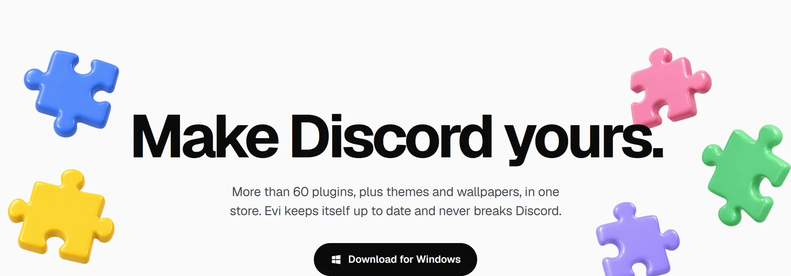

<p align="center">
  <a href="https://evi.rest"></a>
</p>

<p align="center">
  <a href="https://github.com/BleedDev/evi/releases/latest"></a>
  <a href="https://discord.gg/BE4PmvmHB7"></a>
  <a href="LICENSE"></a>
</p>

Evi is a client mod for the Discord desktop app. Plugins and themes from one store, installed in a click, and it keeps working when Discord updates.

## Installing

Get **Evi Setup** from [evi.rest/download](https://evi.rest/download), pick your Discord and click **Install Evi**. Discord restarts with Evi in it. Then press **Ctrl+Shift+D**, or find Evi in Discord's settings.

On a Mac, the first time you open Evi Setup, allow it under System Settings → Privacy & Security. On Linux, mark the download as executable first.

## Making plugins

```sh
git clone https://github.com/BleedDev/evi && cd evi
bun install && bun run build
bun run inject                     # point your Discord at this checkout (quit Discord first)
bun run new-plugin my-plugin       # a working plugin to start from
bun run dev                        # rebuilds as you save, and Discord reloads it
```

See [Writing plugins](docs/plugins.md) and [Developing Evi](docs/development.md).

## Help

Ask in the [Discord server](https://discord.gg/BE4PmvmHB7) or open an [issue](https://github.com/BleedDev/evi/issues). Client mods are against Discord's Terms of Service, so use Evi at your own risk.

## License

[GPL-3.0](LICENSE)
